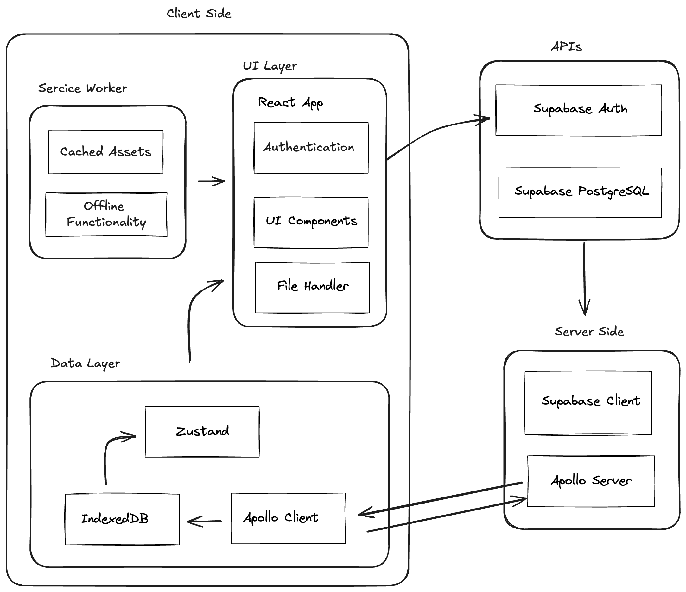
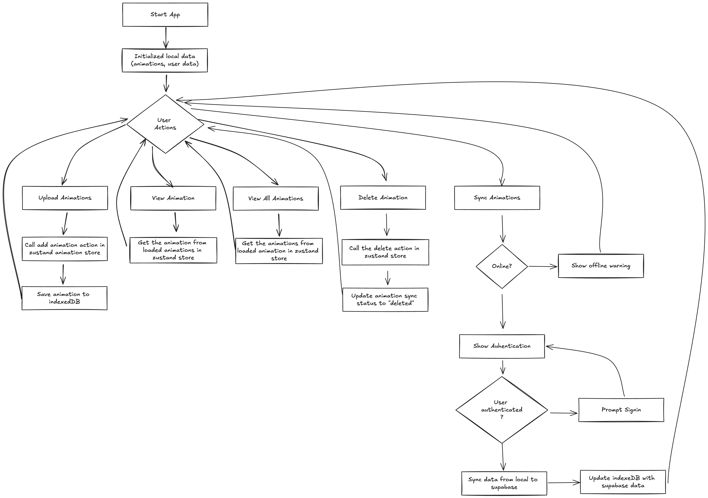

# Lottie Animation Manager

## Overview

Lottie Animation Manager is a Progressive Web App (PWA) that allows users to search, preview, upload, and download Lottie Animations. It features robust offline capabilities, allowing users to interact with animations and access detailed metadata even without an internet connection.

## Key Features

- **Offline-First Functionality**: Seamlessly work with animations offline and sync when back online.
- **GraphQL API**: Efficient data syncing using GraphQL (only for syncing operations).
- **Progressive Web App**: Installable on devices with offline support.
- **Detailed Animation View**: View and interact with animation metadata and controls.
- **File Upload/Download**: Easy upload and download of Lottie animation files.

## Architecture



### Client Side
- **UI Layer**: React App with Authentication, UI Components, and File Handler
- **Data Layer**: 
  - Zustand: State management and single source of truth
  - IndexedDB: Local storage for offline functionality
  - Apollo Client: Used only for syncing data with the server
- **Service Worker**: Manages cached assets and enables offline functionality

### Server Side
- **Apollo Server**: Handles GraphQL operations during sync
- **Supabase Client**: Interacts with Supabase services

### APIs
- **Supabase Auth**: Handles user authentication
- **Supabase PostgreSQL**: Database for persistent storage

## Data Flow



1. App initializes with local data from IndexedDB
2. User actions (upload, view, delete) interact directly with Zustand and IndexedDB
3. Sync process:
   - Checks online status
   - If online, prompts for authentication
   - Syncs data between local storage and Supabase
   - Updates IndexedDB with latest data from Supabase

## Key Architectural Decisions

1. **Offline-First Approach**: All core functionalities work offline, using IndexedDB for local storage.
2. **Zustand as Single Source of Truth**: Decouples UI from data management.
3. **GraphQL for Syncing Only**: Ensures efficient data synchronization when online.
4. **React App Agnostic to Data Source**: UI components interact only with Zustand for modularity.

## Technologies Used

- React with TypeScript
- Zustand for state management
- IndexedDB for local storage
- Service Workers for offline support
- GraphQL with Apollo Client/Server (for syncing)
- Supabase for authentication and database
- Vite for build tooling and development server

## Getting Started

### Prerequisites
- Node.js (v14 or later)
- npm or yarn

### Installation
1. Clone the repository:
   ```
   git clone https://github.com/aldrin-lim/pwa-lottie-animation-manager.git
   cd pwa-lottie-animation-manager
   ```

2. Install dependencies:
   ```
   yarn install
   ```

3. Set up environment variables:
   Create a `.env` file in the root directory and add:
   ```
   VITE_SUPABASE_URL=your_supabase_url
   VITE_SUPABASE_ANON_KEY=your_supabase_anon_key
   ```

4. Start the development server:
   ```
   yarn dev
   ```

5. Open `http://localhost:3000` in your browser.

## Deployment

This project is deployed on Vercel. You can view the live preview [here](https://pwa-lottie-animation-manager.vercel.app/).

## Usage Guide

1. **Viewing Animations**: Browse through the list of animations on the home page.
2. **Uploading**: Click the "Upload Animation" button to add a new Lottie JSON file.
3. **Deleting**: Select an animation and use the delete option.
4. **Syncing**: Use the sync button to synchronize data with the server when online.
5. **Offline Use**: The app works offline. Any changes made offline will sync when you're back online.
6. **Installing as PWA**: Use your browser's "Add to Home Screen" option to install the app on your device.